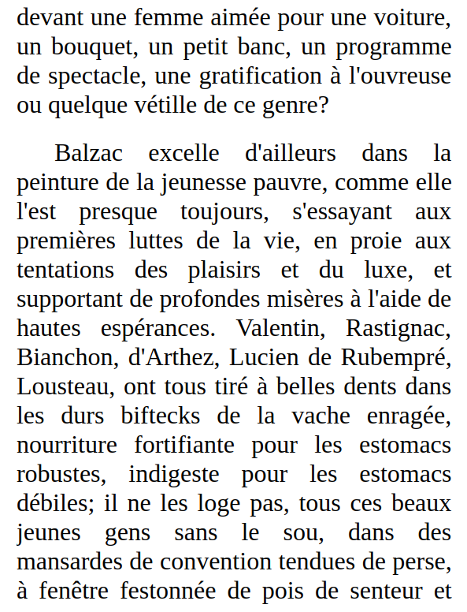

# Requirements: Make sure the following modules are installed
<code>
pytesseract, googletrans
</code>

# Background on the script
The script uses a text image (i.e. French) from an open source such as Gutenberg and then uses pytesseract to extract its text using OCR and feeds this text into google translate for translation from the French language into English.
Once the translation is done, it can be viewed in your text editor (i.e. SublimeText)

# Sources
Gutenberg http://www.gutenberg.org/files/41211/41211-h/41211-h.htm

